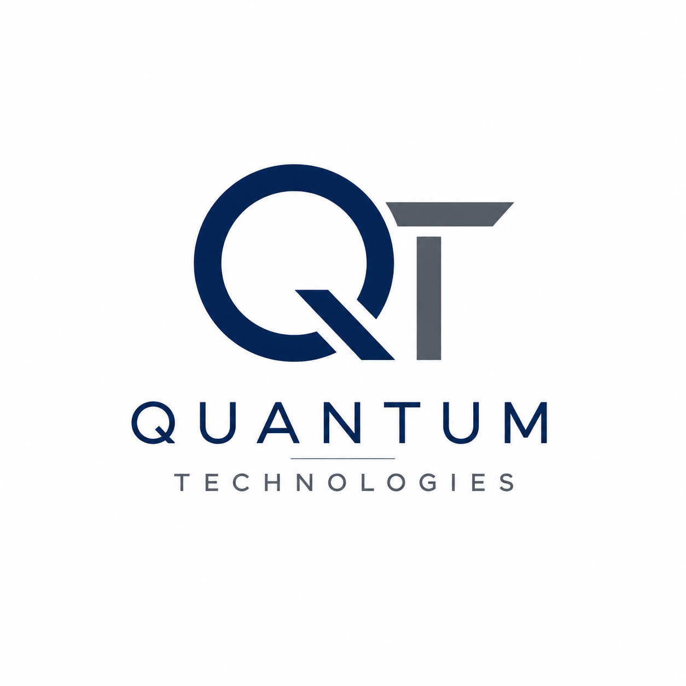

  

<h1 align="center">Crystal Frasier</h1>

<h3 align="center">
Cybersecurity • Artificial Intelligence • Business Operations • Automation
</h3>

Founder of <strong>Quantum Technologies</strong>

---

## Professional Summary

I am a technology professional with experience spanning cybersecurity, artificial intelligence, risk analysis, business operations, quality assurance, customer service, and process improvement.

My passion is solving complex business and technology challenges by combining analytical thinking, secure practices, and practical solutions. I enjoy identifying opportunities to improve efficiency, reduce risk, strengthen security, and help organizations achieve measurable results.
As the founder of Quantum Technologies, I am building innovative solutions focused on cybersecurity, artificial intelligence, automation, and technology consulting while continuing to expand my expertise through hands-on projects, continuous learning, and real-world problem solving.

## About Quantum Technologies

Quantum Technologies is a technology company focused on helping organizations strengthen security, improve operational efficiency, and leverage artificial intelligence to solve real-world business challenges.
Our mission is to combine cybersecurity, AI, automation, and business strategy to create practical, secure, and scalable technology solutions for organizations of all sizes.

Current areas of focus include:

- Cybersecurity Consulting
- Artificial Intelligence Solutions
- Business Process Automation
- Risk Analysis
- Process Improvement
- Technical Documentation
- Security Awareness
- Technology Strategy

## Core Competencies

| Technical | Business | Professional |
|-----------|----------|--------------|
| Cybersecurity | Business Operations | Leadership |
| Risk Analysis | Process Improvement | Problem Solving |
| Artificial Intelligence | Business Process Automation | Critical Thinking |
| Security Awareness | Quality Assurance | Communication |
| Incident Investigation | Technical Documentation | Team Collaboration |
| Linux Fundamentals | Compliance | Customer Service |
| Python | Root Cause Analysis | Continuous Learning |
| Digital Forensics | Technology Strategy | Adaptability |

## Technology Stack

| Category | Technologies |
|----------|--------------|
| 💻 Operating Systems | Windows 10/11 • Linux • Ubuntu |
| 🐍 Programming | Python • Bash (Learning) |
| 🌐 Version Control | Git • GitHub |
| ☁️ Microsoft | Microsoft 365 • Excel • Word • PowerPoint • Outlook |
| 🤖 Artificial Intelligence | ChatGPT • Microsoft Copilot • Google Gemini • Claude |
| 🛡️ Cybersecurity | Risk Analysis • Security Awareness • Incident Response • Digital Forensics (Learning) |
| 🌎 Networking | TCP/IP • DNS • VPN • Remote Desktop |
| 📋 Business | Process Improvement • Technical Documentation • Quality Assurance • Compliance |

## Featured Projects

### 🔐 Python Security Log Analyzer

**Description**

Developed a Python-based log analysis tool that parses authentication logs, identifies suspicious activity, and assists with incident investigations.

**Skills Demonstrated**

- Python
- Log Analysis
- Incident Response
- Cybersecurity
- File Handling

---

### 🛡️ Incident Response Report

**Description**

Created a structured incident response report documenting security findings, investigation methodology, risk assessment, and remediation recommendations.

**Skills Demonstrated**

- Incident Response
- Risk Analysis
- Technical Documentation
- Security Operations

---

### 🐧 Linux Security Lab

**Description**

Hands-on Linux environment used to strengthen command-line skills, security fundamentals, networking concepts, and system administration.

**Skills Demonstrated**

- Linux
- Ubuntu
- Bash
- Networking
- Security Fundamentals

---

### 🤖 AI Business Automation

**Description**

Developing AI-assisted workflows to improve operational efficiency, automate repetitive business processes, and enhance decision-making.

**Skills Demonstrated**

- Artificial Intelligence
- Automation
- Process Improvement
- Business Operations

## 💼 Professional Experience Highlights

- Led quality assurance initiatives that generated over **$250,000** in annual cost savings.

- Managed and coached teams while improving operational efficiency and quality performance.

- Achieved a **95% commercial collections recovery rate** through effective account management.

- Investigated operational issues using root cause analysis and implemented corrective actions.

- Extensive experience supporting customers through high-volume technical and business environments.

- Strong background in quality assurance, compliance, business operations, customer service, and process improvement.

## 🎓 Certifications

### 🛡 Google Cybersecurity Professional Certificate
**Google / Coursera**

Topics Covered
- Security Foundations
- Linux
- SQL
- Python
- Network Security
- Security Operations (SOC)
- Incident Response
- Risk Management
- Threat Detection
- SIEM Fundamentals

---

### 📚 Additional Training

- Linux Fundamentals
- Git & GitHub
- Artificial Intelligence Tools
- Prompt Engineering
- Business Process Automation
- Digital Forensics (In Progress)

## 📚 Current Learning

I believe technology is constantly evolving, so continuous learning is part of my professional journey.

Currently expanding my knowledge in:

- 🛡️ Ethical Hacking
- 🔍 Digital Forensics
- ☁️ Cloud Security
- 🤖 Artificial Intelligence & Machine Learning
- 🐍 Advanced Python Programming
- 🐧 Linux Administration
- 🌐 Network Security
- 📊 Threat Intelligence
- ⚙️ Business Process Automation
- 💻 GitHub Portfolio Development

## 🎯 Vision

My vision is to build Quantum Technologies into a trusted technology company that helps organizations strengthen cybersecurity, embrace artificial intelligence, automate business processes, and improve operational efficiency.

I am committed to lifelong learning, innovation, and developing practical technology solutions that create measurable business value while helping organizations stay secure in an evolving digital world.

As my career continues to grow, I plan to expand into cybersecurity consulting, AI-powered business solutions, digital forensics, threat intelligence, and secure software development.

## 🤝 Let's Connect

Thank you for taking the time to explore my portfolio.

I'm passionate about building secure, intelligent, and practical technology solutions that make a real impact. I enjoy connecting with professionals, mentors, recruiters, and fellow technology enthusiasts who share an interest in cybersecurity, artificial intelligence, automation, business operations, and continuous learning.

### 🌐 Connect with Me

- 💼 **LinkedIn:** https://www.linkedin.com/in/crystal-frasier-ga
- 💻 **GitHub:** https://github.com/frasierjcrystal-tech
- 📧 **Professional Email:** frasierjcrystal@gmail.com

---

> *"Technology is more than solving problems—it's creating opportunities, protecting people, and building a safer, smarter future through innovation."*

**Thank you for visiting my portfolio. I appreciate your time and hope my work inspires future collaboration.**
